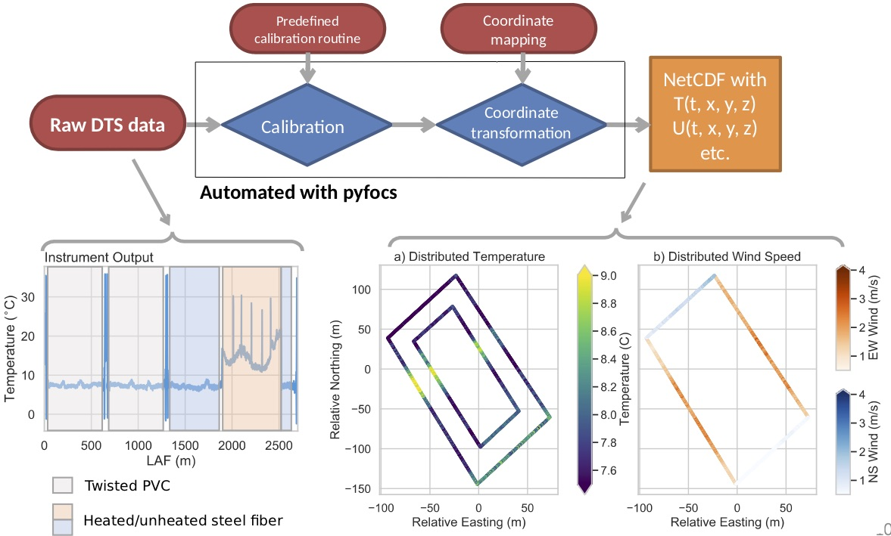

# pyfocs

version==0.3.1.

pyfocs has been known by btmm_process (obscure non-pythonic name) and pyfox (an unmaintained package on PyPi) resulting in the new name for the library.

# Overview

pyfocs is the University of Bayreuth Micrometeorology python library for processing Fiber Optic Distributed Sensing (FODS) data. It is intended to streamline the handling of large and long-term DTS setups.


It automates the calibration and mapping of FODS data allowing the user to focus on the science. Calibration is robustly handled using the [dtscalibration package](https://github.com/dtscalibration/python-dts-calibration) (des Tombe, Schilperoort, and Bakker, 2020). pyfocs can robustly handle an arbitrary fiber geometry, number of reference sections, and fiber calibration setup (through the dtscalibration package).

The library consists of the automation script (`PyFOX.py`) used to herd the data from raw format to physically labeled and calibrated data in the netcdf format (see figure). Unfortunately pyfocs only supports Silixa Distribute Temperature Sensing (DTS) devices, such as an Ultima or XT, at the moment. This library is built around the [xarray](http://xarray.pydata.org) package for handling n-dimensional data, especially in a netcdf format.

Also included are a family of functions for calculating wind speed from FODS data as well as other common statistical techniques, data manipulation, and diagnostics plots for FODS. See the example notebooks for more details.

# PyFOX Steps

Data and the surrounding directory structure is assumed to follow this outline.
.

Each Subdirectory corresponds to a particular step in the processing.

1) Archives original `.xml` files into specified time interval.

2) Creates netcdfs of the raw data, including the instrument reported temperature, stokes intensity, and anti-stokes intensity. Dimensions of Length Along the Fiber, `LAF`, and time.

3) Integrates external data streams and other reference data, performs step-loss corrections, performs the user-defined calibration based on des Tombe et al, (2020). Returns instrument reported temperature, calibrated temperature, log-power ratio of stoke and anti-stokes intensities, stokes intensity, anti-stokes intensities, and all data labels. Dimensions are `LAF` and `time`. New coordinates specified by location type in the location library can be used to label the data along with a `number of labels` by `number of LAF` coordinate.

4) Converts data labels with physical coordinates. Drops the LAF label and only includes the physical location (`xyz`) and `time`. Facilitates matching coordinates between sections for performing wind speed calculations along a common `x`, `y`, and `z` coordinate.

# Installation

This installation assumes you have the anaconda distribution of python. If you do not have anaconda see the basic [troubleshooting section](#Troubleshooting).

pyfocs can be installed by using:

`pip install pyfocs`

which installs pyfocs plus all dependencies.

If you encounter errors when running pyfocs using this method, we instead recommend installing from source. Download the source code from this repository (green button with "Clone or Download"), extract the package, navigate to the directory containing the `setup.py` file, and install using `pip install .`.

Both methods should result in the `PyFOX.py` script being callable from the command line.

## Example jupyter notebooks

### References

des Tombe, B.; Schilperoort, B.; Bakker, M. Estimation of Temperature and Associated Uncertainty from Fiber-Optic Raman-Spectrum Distributed Temperature Sensing. Sensors 2020, 20, 2235.

Hausner, M. B., Suárez, F., Glander, K. E., & Giesen, N. Van De. (2011). Calibrating Single-Ended Fiber-Optic Raman Spectra Distributed Temperature Sensing Data. Sensors, 11, 10859–10879. https://doi.org/10.3390/s111110859

### Muppet Archiver

Batch script for scheduled archiving of `.xml` files on the Silixa DTS devices. Why muppet? Unviersity of Bayreuth Micrometeorology names their Silixa devices after muppet characters. Requires an anaconda 3.* distribution of python. Task scheduler must point to the `.bat` script and not the python script.

## <a name="Troubleshooting"></a>Troubleshooting/First time with python

### Install the anaconda version of python
https://www.anaconda.com/distribution/#download-section

You should be prompted to install python for your particular OS. Install a version >=3.6.

### PyYAML updating
An error in an old version of pip stops the updating of PyYAML. If you get an error related to this library you can solve it with:

`pip install --ignore-installed PyYAML`

### Windows specific stuff
You will always need to use the anaconda power prompt or a similar environment. You will find it difficult/impossible to run python outside of the anaconda environment.

From https://www.correlatedsolutions.com/support/index.php?/Knowledgebase/Article/View/85/1/running-python-scripts-from-anywhere-under-windows

```
For the first time, windows asks what application to use to run *.py files.
Select python in Anaconda directory: make sure check box "Always use this app to open .py files" is checked
Click "More Apps"
Click "Look for another app on this PC"
Find path to anaconda python, e.g. "C:\Users\Your Name\Anaconda3\python"
Click "Open"
Click "OK"
```

Other issues may be related to running the anaconda prompt without administrator issues.
